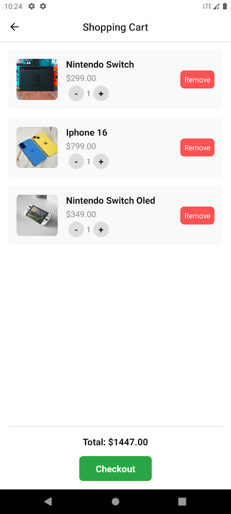
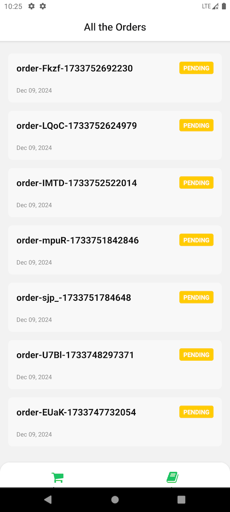

# React Native Shop(rn-shop)

## 项目介绍

该项目 clone 自[https://github.com/laribright/gadgets-app-react-native](https://github.com/laribright/gadgets-app-react-native)，并进行了一些 bug 修复以及样式调整，添加了 e2e 测试，主要是为了学习 react-native 和 maestro。

rn-shop 是基于 expo 开发的电商购物应用，主要功能有：注册、登录、商品列表、商品详情、购物车、支付、订单列表、订单详情等。

管理 web 端项目地址：[https://github.com/testerxiaodong/next-shop-admin](https://github.com/testerxiaodong/next-shop-admin)

## 如何运行该项目

### 注册 supabase 以及 stripe 账号，新建项目(项目名随意)，将`.env.example`文件重命名为`.env`，填入自己的 supabase 项目信息(project->settings) 以及 stripe 开发者密钥

### 新增 supabase 数据表、触发器函数、存储过程、边缘函数

supabase 不支持 pg_dump 导出数据表，推荐看视频博主的教程，教程有分段信息介绍：[https://www.youtube.com/watch?v=26opRFPU0a8](https://www.youtube.com/watch?v=26opRFPU0a8)

## 项目概览

### 注册和登录页面

### 首页

### 分类列表页

### 商品详情页

### 购物车页面

### 支付页面

### 订单列表页

### 订单详情页

## 端到端测试

## 鸣谢

感谢大佬的视频教程：@[codewithlari](https://www.youtube.com/@codewithlari)
视频教程地址：[https://www.youtube.com/watch?v=26opRFPU0a8&t=16137s](https://www.youtube.com/watch?v=26opRFPU0a8&t=16137s)
